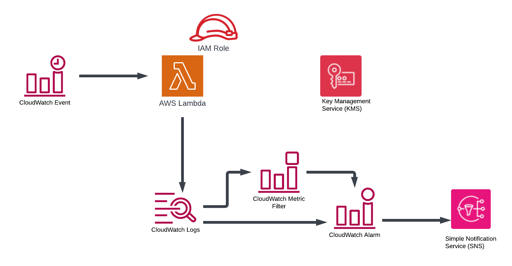

# Overview  

Please see blog site https://devbuildit.com/2024/06/04/monitoring-amazon-lambda-functions/ for detailed explaination of this repo contents.

This repo (and associated blog) will help you to setup an environment to monitor a Amazon Lambda Function. The base infrastructure is shown below;

# Installation  

Please see https://devbuildit.com/2024/06/04/monitoring-amazon-lambda-functions for detailed explaination.

## Requirements: ##
- AWS Account
- Terraform CLI installed with access to your target AWS account (via temporary Indentity centre credentials or AWS IAM access keys)

## Deployment
- Clone repo into a source folder
- Update file variable with default region (otherwise this will deploy to ap-southeast-2 by default)
- Consider changing application name in file variables.tf (default will work fine)
- Run command 'Terraform init' in source folder
- Run command 'Terraform plan' in source folder
- Run command 'Terraform apply' in source folder and approve apply
